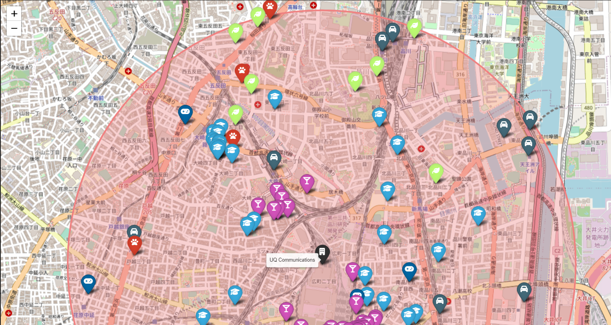

# Project 2: Geospatial-data | Marco Ayora Arsic 

## Introduction 

In this project I have taken my role as a data analyst further away. In order too look for a new office for the gaming company I am working for I have compared multiple existing offices of the city of Tokyo one of the biggest cities involved in the business of gaming developement, while taking in account as much as possible all the needs of each of the corporates of the business; such as close starbucks to the office to satisfy the 10 executives.

## Data Source

My offices data have come from the companies database from MongoDB. While all the coordinates and data about all points of interests like bars, Starbucks, educative centers... Were implemented through the API Foursquare.

## Methodology

the libraries i have used are the following: 

- To make HTTP requests//import requests
- To transform into JSON format //import json
- For data manipulation //import pandas as pd
- To not filtrate my passwords //from getpass import getpass
- To make comands directly to the OS //import os
- To create interactive maps //import folium
from folium import Choropleth, Circle, Marker, Icon, Map
from folium.plugins import HeatMap, MarkerCluster

- To store my token //from dotenv import load_dotenv
load_dotenv()

- To work with geospatial data //import geopandas as gdp
from cartoframes.viz import Map, Layer, popup_element

- To interact with MongoDB //from pymongo import MongoClient
from pymongo import GEOSPHERE
import pymongo

- To print in a more readable format //import pprint

The whole project is divided in different sections:

#### Tests:

In this first-section of the project i have tried a smaller and simpler version on how i will make the project. I tried on working and creating the base of many functions i later used such as the Foursquare requests , creating a map and adding markers to a map.

#### Getting offices from MongoDB:

Here is where the real project starts. I selected all the offices of companies from the companies Database of MongoDB. Then i kept only the offices that were located on tokyo as well as all the data involving the offices like the addreses, zip code etc. Once organised intoo a dataframe we can observe that there is only 3 coordinates offered in the database. To solve this problem, i used a function that reads the addresses and prints them as the coordinates, in order to have a more selected base of options as offices. Then we just have to clean the dataframe in order to just keep the indexes, the column of names, and two columns one for the latitude and the other  for the longitude.

### Requests of foursquare:

In this step i only had to use the previous Foursquare fucnctions that i had built in my first step, the only difference is that instead of making it for only one exact office i had to iterate for each of the offices coordinates i had in my offices dataframe.

### Exporting and creating collections in MongoDB:

After my 8 requests of Foursquare were completed and i had my 8 dataframes i only had to export them as collections in MongoDB and introduce them  indexes of 2d sphere and geomtry to  later use the $near function.

### Add all the collections into a same DataFrame:

Here is where i used the geo near funtion to look for each point of interest in each office and look how many points of interests has each office,  while adding them to the original offices dataframe. After i had done this the 8 times i had my definitive DataFrame but now i had to look for the most valuable office.

### Getting the most valuable :

To look for the most valuable office i had to create a score on the amount of points of interests in each office. By giving a value to each type of point of interests and multiplying by the number of quantity. Then order descendengly to get in first place the most valuable office.

### Visualization:

Even though i already knew which was already the most suitable office i wanted to demonstrate it through a map like i did at the beginning in the test section through markers. This way it is also easier to explain the whole project through the interactive map, as well to see where is this office located. 

## Results

After categorizing all my data with dictionaries through MongoDB i could import and add all the offices and look in a radius of 2km for each office what points of interests could i find(starbucks, bars...). The following image of the interactive map is a random example on how we can see an office, its radius and all the points of interest in a radius of 2km:

## Conclusion

After looking at our DataFrame of vales as well as the map we can determine that the office that would suit the most people in the company is the office of Metacast located in the heart of Tokyo and in one of its most well known zones; Shibuya. 

## Sources/Links

https://www.icex.es/content/dam/es/icex/oficinas/119/documentos/2022/12/estudio-mercado/EM_Mercado%20del%20videojuego%20en%20Jap%C3%B3n%202022_REV.pdf

https://www.google.es/maps/preview

https://foursquare.com/

https://python-visualization.github.io/folium/latest/reference.html

https://medium.com/datasciencearth/map-visualization-with-folium-d1403771717